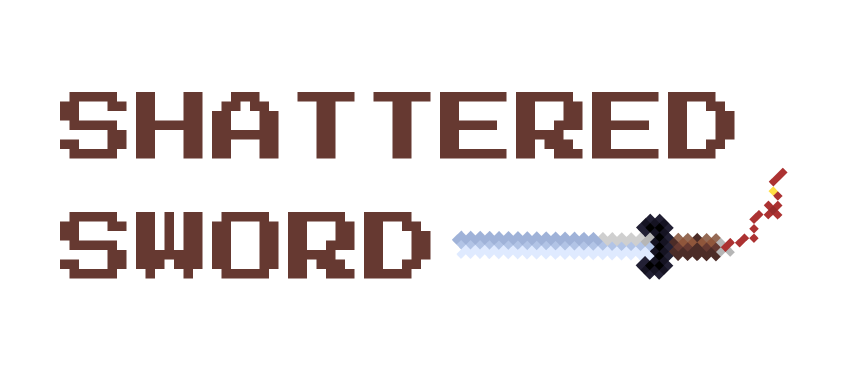

# Shattered Sword
CSE380 2D Game Design Project, Spring 2022

## Deployed site
:link: [shattered-sword.firebaseapp.com](https://shattered-sword.firebaseapp.com)

:link: [https://shattered-sword.firebaseapp.com/benchmark1](https://shattered-sword.firebaseapp.com/ShatteredSwordGameDesignDocument.html)

:link: [https://shattered-sword.firebaseapp.com/benchmark2](https://shattered-sword.firebaseapp.com/benchmark2.html)

## About our team
Henry Chen, Kelly Peng, Renge

# Game Engine
## How to transpile and run

Start gulp by just running `gulp` in the console. Start the code by running `dist/main.js` with Web Server for Chrome or a similar product. Anytime you save, gulp should recompile the code automatically.

Setup follows [this helpful guide from TypeScript] (https://www.typescriptlang.org/docs/handbook/gulp.html) (Up through Watchify).
